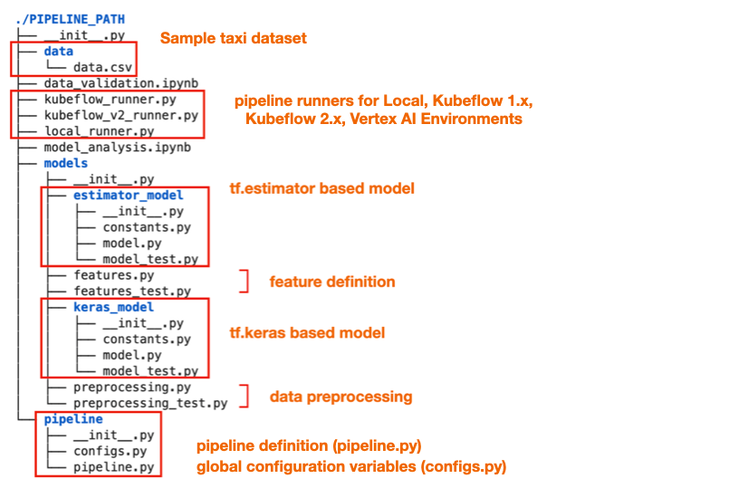
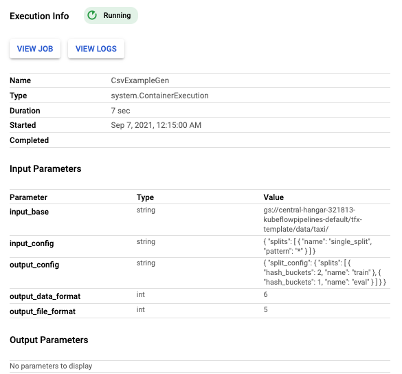




TensorFlow Extended(TFX) gives you the power of building a end to end machine learning pipeline. However it is somewhat difficult to grasp the ideas coupled with the actual codebase, and it is non trivial to write an entire machinie learning project from scratch. 

The main advantage of using TFX CLI is that you can get a fully working end to end example out of the box. Also, many customizable points are already included such as how to leverage BigQuery, Vertex AI Training/Serving, Dataflow GCP infrastructure. You will see a full capability of TFX at hand with a template project. 

In this codelab, you will use Vertex AI to run TFX Pipeline.

## **Before you begin**

Please follow [Learn how to setup Vertex AI Notebook for pipelines](https://gde-codelabs.github.io/posts/vertex-ai-notebook/#0) codelab to setup Vertex AI Notebook. 

## **What you'll learn**
- How to create TFX pipeline project
- How to compile TFX pipeline
- How to build TFX pipeline
- How to run TFX pipeline on Vertex AI

## **What you'll need**
- A Google Cloud Project
- A Browser, such as Chrome or Firefox
- Familiarity using Python
- Familiarity using TFX





### 1. Setup pipeline name and path. 

```bash
PIPELINE_NAME=tfx-pipeline
PIPELINE_PATH=./tfx-pipeline
```

### 2. Create TFX pipeline project. 

You can create a TFX pipeline project with `tfx template copy` CLI. The `--model` option lets you choose a template model. There are `taxi` and `penguin` as the moment writing this codelab. The `--pipeline-name` sets the name of the pipeine, and the `--destination-path` is the target directory the pipeline project will be created. 

```bash
$ tfx template copy --model=taxi \
       --pipeline-name=$PIPELINE_NAME \
       --destination-path=$PIPELINE_PATH
```

### 3. Print what's include in the populated project.
```bash
$ tree ./$PIPELINE_PATH
```

### 4. Examine each files and directories.


You can explore what's included in each file, but here is a short description.

### *_runner.py
  - `local_runner.py` lets you run the pipeline in local environment. You don't need any orchestrator installed on your local environment. It is used to verify the code. You can choose `kubeflow_runner.py` if the underlying orchestrator is based on Kubeflow 1.x. If your system supports Kubeflow version > 2.0, you need `kubeflow_v2_runner.py`. `Vertex AI Pipeline` platform is also based on Kubeflow 2.x, `kubeflow_v2_runner.py` should be selected if you want to load the pipeline on Vertex AI.

### models
  - The data preprocessing and modeling(based on `tf.keras` and `tf.estimator`) files are listed in `models` directory. You can find how to write modules for TFX `Transform` and `Trainer` components.

### pipeline
  - `pipeline/pipeline.py` defines the whole pipeline. You can find how each TFX component is connected each other to build up the whold pipeline. Also, you can think of `pipeline/configs.py` as a place to define global variables used across the project. This file is important when you want to leverage `Vertex Training` and `Vertex Precition` services. You can find what the configurations for each looks like.





Before running the pipeline, it should be created or compiled. TFX provides `tfx pipeline create` and `tfx pipeline compile` CLIs for this purpose. Let's see what they do.

```bash
$ tfx pipeline create --pipeline-path=... \
       --engine=... \ 
       --build-image
```

`tfx pipeline create` CLI is used to create tfx pipeline. `--pipeline-path` is a mandatory argument, and the one of the paths for `local.py`, `kubeflow_runner.py`, or `kubeflow_v2_runner.py ` should be specified. Also note that `--engine` parameter should be specified accordingly. The [official document](https://www.tensorflow.org/tfx/guide/cli#create) says "If the engine is not set, the engine is auto-detected based on the environment.", but it is safe to be set manually. 

```bash
$ tfx pipeline update \
       --pipeline-path=... \
       --engine=... \ 
```

`tfx pipeline update` CLI lets you update the previously created pipeline. All the arguments from `tfx pipeline create` are also available for `tfx pipeline update` CLI. That means you can update the existing pipeline whenever there is any changes. However, please note that you don't update a pipeline to be run in different environment even though the names are the same (i.e. from `local` to `vertex`).

When `--build-image` option is specified, TFX CLI will build a custom TFX docker image, and every component will be run based on the built image. The image tag can be modified with `PIPELINE_IMAGE` defined in `pipeline/configs.py`.

```bash
$ tfx pipeline compile \
       --pipeline-path=... \
       --engine=... \ 
```

Once you run `tfx pipeline create`, you can run the pipeline. However, you have to run `tfx pipeline create` whenever the local environment changes. For instance, there are a number of situations that only fresh environment is availalbe such as GitHub Action, Cloud Build, and so on. 

In the following steps, let's see how to create and run a pipeline in local and Vertex AI environment.





### 1. Create pipeline with `local_runner.py`

As discussed before, we need to sepcify `--pipeline-path` to `local_runner.py` and `--engine` to `local` in order to create a pipeline to be run in local environment. 

```bash
$ tfx pipeline create \
      --pipeline-path=$PIPELINE_PATH/local_runner.py \
      --engine=local
```

You will see `Pipeline "tfx-pipeline" created successfully.` message if the pipeline is successfully created.

### 2. Run the pipeline

After the pipeline creation, we can run the pipeline with `tfx run create` CLI like below. Notice that we only need to let the CLI know the name of pipeline with `--pipeline-name` since it was created before.

```bash
$ tfx run create \
      --pipeline-name=$PIPELINE_NAME \
      --engine=local
```

This will print out a long text like below. Basically what it tells us is all the metadata from the TFX pipeline. For further information about the metadata, please take a look at [ MLMD(ML Metadata) ](https://www.tensorflow.org/tfx/guide/mlmd). 

```bash
INFO:absl:Running pipeline:
 pipeline_info {
  id: "tfx-pipeline"
}
...

custom_driver_specs {
  key: "CsvExampleGen"
  value {
    python_class_executable_spec {
      class_path: "tfx.components.example_gen.driver.FileBasedDriver"
    }
  }
}
metadata_connection_config {
  sqlite {
    filename_uri: "./tfx_metadata/tfx-pipeline/metadata.db"
    connection_mode: READWRITE_OPENCREATE
  }
}
...

INFO:absl:MetadataStore with DB connection initialized
INFO:absl:select span and version = (0, None)
INFO:absl:latest span and version = (0, None)
INFO:absl:MetadataStore with DB connection initialized
INFO:absl:Going to run a new execution 10
...
...
INFO:absl:Component CsvExampleGen is finished.
```

The only things you need to care about is `custom_driver_specs` to check if the pipeline was run on local environment. It basically says TFX pipeline uses `sqlite` as the backend metadata store and `FileBasedDriver` to interact with `sqlite`. As you know `sqlite` is a in-memory database hosted on local environment, so it is used here for `local_runner.py` as well.

When you create a template project with TFX CLI, the only included TFX component is `CSVExampleGen`. That is why you only see any metadata related to `CSVExampleGen`. If you want to run the pipeline with the other TFX components, please open up `pipeline/pipeline.py` and uncomment `components.append(...)` statements. 






Before running the pipeline on Vertex AI, it assumes the data is stored in the cloud. You can find out the exact location in `_DATA_PATH` variable from `kubeflow_v2_runner.py`. It says the pipeline will read the data from `'gs://{}/tfx-template/data/taxi/'.format(configs.GCS_BUCKET_NAME)`, and the `configs.GCS_BUCKET_NAME` is `GCS_BUCKET_NAME = GOOGLE_CLOUD_PROJECT + '-kubeflowpipelines-default'`. You don't have to use this name, and you can simply change it as you like. However, we will use the every names as they are to be clear.

### 1. Create a GCS bucket

A GCS Bucket can be created using `gsutil` CLI tool, and it is pre-installed if you are using Vertex AI Notebook. Otherwise, you can follow the [official document](https://cloud.google.com/storage/docs/gsutil_install) to install `gsutil` for your environment.

```bash
$ GCP_PROJECT_ID="..."
$ gsutil mb \ 
    -c standard \
    -l us \
    gs://$GCP_PROJECT_ID'-kubeflowpipelines-default'
```

Please check out the [official document](https://cloud.google.com/storage/docs/gsutil/commands/mb) for more detailed information about `gsutil mb` CLI. To simply put the above command, it creates a GCS bucket named `gs://...` in `us` location, and the bucket will be the standard class.

### 2. Copy data.csv to GCS bucket

TFX template project provides a default dataset, and it is stored in `data/data.csv` for taxi template. The command below simply copies the `data/data.csv` to the designated GCS location. You don't explicitly have to create the nested directories.

```bash
$ gsutil cp \
    $PIPELINE_PATH/data/data.csv \
    gs://$GCP_PROJECT_ID'-kubeflowpipelines-default'/tfx-template/data/taxi/
```

### 3. Create a pipeline with `kubeflow_v2_runner.py`

Now we can create the pipeline for Vertex AI. As you see, we don't `update` the one created for `local` run, but we create the other pipeline with the same name and different environment, `vertex`. Just make sure you specify the `--pipeline-path` to where the `kubeflow_v2_runner.py` is and `--engine` to `vertex` for Vertex AI. 

Also, because each TFX component is run based on a docker image, we need to specify which docker image to use. By default `kubeflow_v2_runner.py` will try to use custom docker image built from the current pipeline source codes. However, the docker image hasn't been built yet, so we need to set `--build-image` option in `tfx pipeline create` CLI.

```bash
$ tfx pipeline create \
      --pipeline-path=$PIPELINE_PATH/kubeflow_v2_runner.py \
      --engine=vertex
      --build-image
```

With `--build-image` option, you will see the process of the docker image being built in the output. Additionally, if you want you can modify `Dockerfile` in the root directory of the project.

### 4. Run the pipeline

Runnning the pipeline on Vertex AI is not so different. You have to make sure `--engine` is set to `vertex`. Also, because Vertex AI pipeline is a serverless platform, you need to tell which GCP Project and Region you want to run the pipeline on. So there are `--project` and `--region` options.

```bash
$ GCP_PROJECT_REGION="us-central1"
$ tfx run create \
      --pipeline-name=$PIPELINE_NAME \
      --engine=vertex \
      --project=$GCP_PROJECT_ID \
      --region=$GCP_PROJECT_REGION
```

After running `tfx run create` CLI, you will see the output like below. 


### 5. View from GCP Console

If you visit [Vertex AI Pipeline](https://console.cloud.google.com/vertex-ai/pipelines), you will see the running pipelines are listed. Click the one that you have created, then you will see the graph like below. As the procedure goes by, each node will be filled with colors (green for runnning and success, red for failure).

Please note that the below figure is achieved by uncommenting all the `components.append(...)` statements in `pipeline/pipiline.py`.


At this point, you can click one of the nodes. Then detail information will show up in the right pane. It basically tells you the metadata of the node. You can find out what kind of input it took, and which output it produced. 




