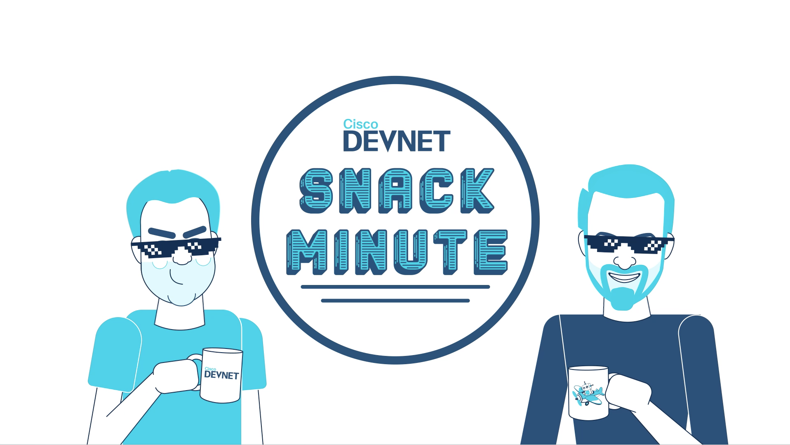

<!-- Overview Step is a required step and must be at the beginning of each codelab -->


### What you’ll Learn
- How to create steps
- How to include code snippets
- How to include links and images
- Call to Action

### What you'll need
- Any required application or library 
- Access to a Sandbox




- Each step should be contained with `{ {< step >}}` template string like below. 
- You can give title for each step with the `label` attribute, and the estimated duration can be specified in `duration` attribute as well.

<!-- When defining steps, Make sure there is no spaces between the brackets {{ -->

```
{ {<step label="Overview" duration="1:00" >}}

WRITE YOUR OWN CONTENT

{ {<step>}}
```




To include code snippets you can do a few things.
- Inline highlighting can be done using the tiny tick mark on your keyboard: "`"
- Embedded code

### Python

```python
import requests
```

### JavaScript

```javascript
{ 
  key1: "string", 
  key2: integer,
  key3: "string"
}
```

### Java

```java
for (statement 1; statement 2; statement 3) {
  // code block to be executed
}
```



## Hyperlinking
[Snack Minute](https://www.youtube.com/playlist?list=PL2k86RlAekM-Qdu_In2-8B1YT6c66MnY0)

## Images




<!-- Call to Action Step is a required step and must be at the end of each codelab -->

## Learn More
- Link to Learning Content in new LXP
- Link to other walkthroughs 
- Link to Marketing offer page



